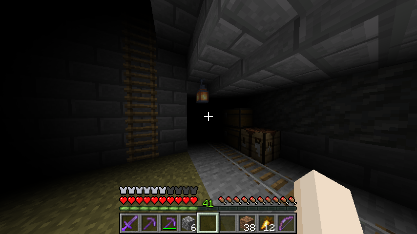

# BlindMe

A client-sided mod that gives you the Blindness (or Darkness) effect all the time.
Configurable per world and server.

Currently a beta version, there might be some bugs.
Licensed under MIT, made by hibi.

## Using

By default, new worlds and servers don't have any effects turned on.
To change this, use the `/blindme` command, or use the settings screen, accessible through Mod Menu or through the `/blindme settings` subcommand.

## Requirements

- Quilt Loader
- Quilt Standard Libraries
- Mod Menu (optionally)
