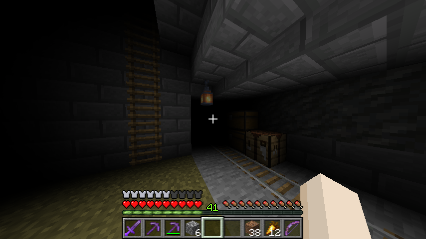

# BlindMe

A client-sided mod that gives you the effect of Blindness all the time.
Configurable per world and server.

Licensed under MIT, made by hibi.

## Using

By default, new worlds and servers don't have any effects turned on.
To change this, use the `/blindme` command, or use the settings screen accessible through Mod Menu.

## Requirements

- Quilt Loader / Fabric Loader
- Quilt Standard Libraries / Fabric API
- YACL
- Mod Menu (optionally)
